cm007 Exercises: Exploring Aesthetic Mappings
================

``` r
library(tidyverse)
```

    ## -- Attaching packages ---------------------------------- tidyverse 1.2.1 --

    ## v ggplot2 3.0.0     v purrr   0.2.5
    ## v tibble  1.4.2     v dplyr   0.7.6
    ## v tidyr   0.8.1     v stringr 1.3.1
    ## v readr   1.1.1     v forcats 0.3.0

    ## -- Conflicts ------------------------------------- tidyverse_conflicts() --
    ## x dplyr::filter() masks stats::filter()
    ## x dplyr::lag()    masks stats::lag()

``` r
library(gapminder)
```

Beyond the x and y aesthetics
=============================

Switch focus to exploring aesthetic mappings, instead of geoms.

Shapes
------

-   Try a scatterplot of `gdpPercap` vs `pop` with a categorical variable (continent) as `shape`.

``` r
gvsl <- ggplot(gapminder, aes(gdpPercap, lifeExp)) +
  scale_x_log10()
gvsl + geom_point(aes(shape=continent), alpha=0.2)
```

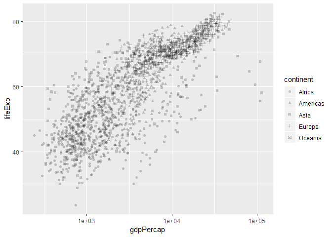

-   As with all (?) aesthetics, we can also have them *not* as aesthetics!
    -   Try some shapes: first as integer from 0-24, then as keyboard characters.
    -   What's up with `pch`?

``` r
gvsl + geom_point(shape="$")
```

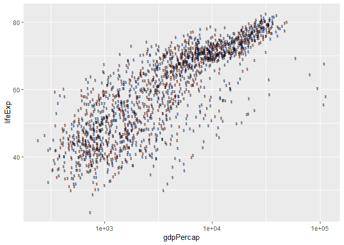

``` r
#gvsl + geom_point(pch=7)
```

List of shapes can be found [at the bottom of the `scale_shape` documentation](https://ggplot2.tidyverse.org/reference/scale_shape.html).

Colour
------

Make a scatterplot. Then:

-   Try colour as categorical variable.

``` r
gvsl + geom_point(aes(colour = continent))
```

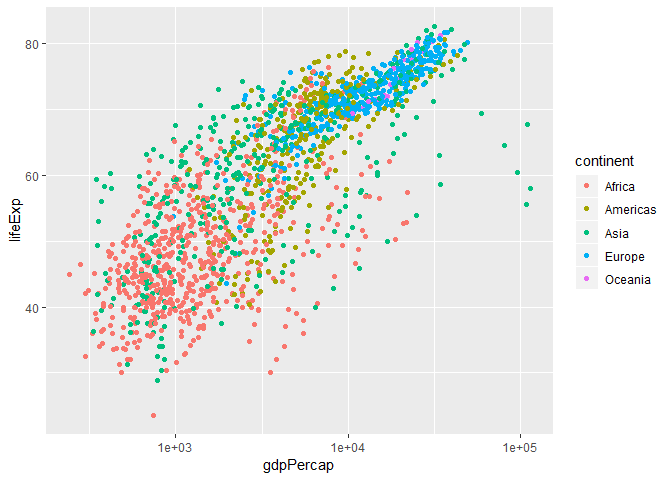

``` r
#gvsl + geom_point(aes(color = continent))
```

-   Try `colour` and `color`.
-   Try colour as numeric variable.
    -   Try `trans="log10"` for log scale.

``` r
gvsl + geom_point(aes(colour=pop))
```

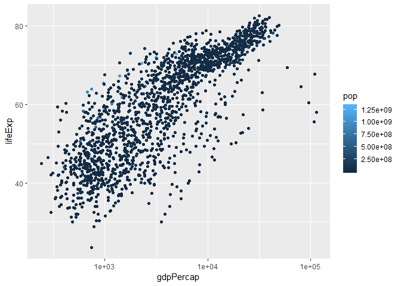

``` r
gvsl + geom_point(aes(colour=log(pop))) # Not the best option as then scale is just the number of the exponent not 10e5 or what have you
```

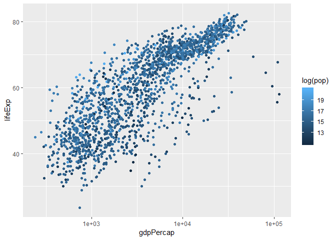

``` r
gvsl + geom_point(aes(colour=pop)) + scale_colour_continuous(trans="log10")
```

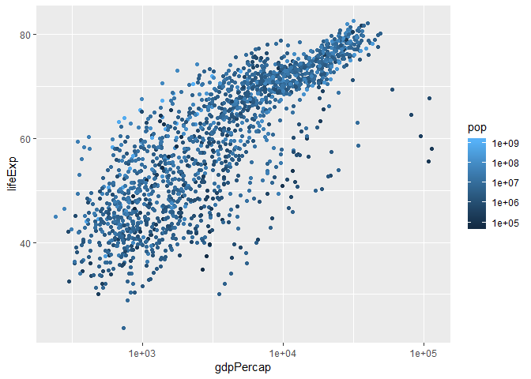

Make a line plot of `gdpPercap` over time for all countries. Colour by `lifeExp > 60` (remember that `lifeExp` looks bimodal?)

``` r
gvsl + geom_point(aes(colour = lifeExp > 60))
```


Try adding colour to a histogram. How is this different?

``` r
ggplot(gapminder, aes(lifeExp)) + 
  geom_histogram(aes(colour=continent))
```

    ## `stat_bin()` using `bins = 30`. Pick better value with `binwidth`.

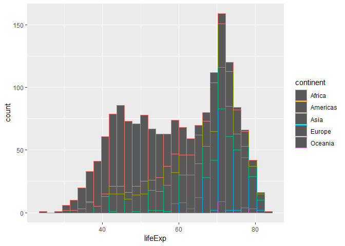

``` r
ggplot(gapminder, aes(lifeExp)) + 
  geom_histogram(aes(fill=continent))
```

    ## `stat_bin()` using `bins = 30`. Pick better value with `binwidth`.


Facetting
---------

Make histograms of `gdpPercap` for each continent. Try the `scales` and `ncol` arguments.

``` r
ggplot(gapminder, aes(lifeExp)) +
  facet_wrap( ~ continent) +
  geom_histogram()
```

    ## `stat_bin()` using `bins = 30`. Pick better value with `binwidth`.


``` r
ggplot(gapminder, aes(lifeExp)) +
  facet_wrap( ~ continent, scales = "free_x") +
  geom_histogram()
```

    ## `stat_bin()` using `bins = 30`. Pick better value with `binwidth`.

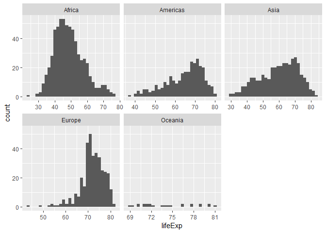

Remove Oceania. Add another variable: `lifeExp > 60`.

``` r
ggplot(gapminder, aes(gdpPercap)) + 
  facet_grid(continent ~ lifeExp > 60) +
  scale_x_log10() + 
  geom_histogram()
```

    ## `stat_bin()` using `bins = 30`. Pick better value with `binwidth`.

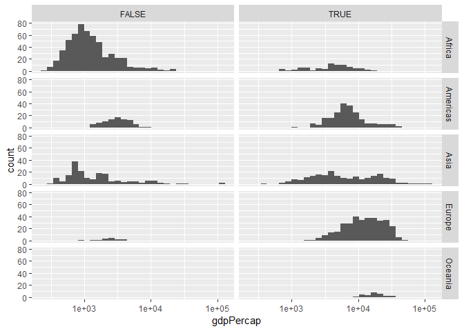

Bubble Plots
------------

-   Add a `size` aesthetic to a scatterplot. What about `cex`?

``` r
gvsl + geom_point(aes(size=pop), alpha=0.5)
```

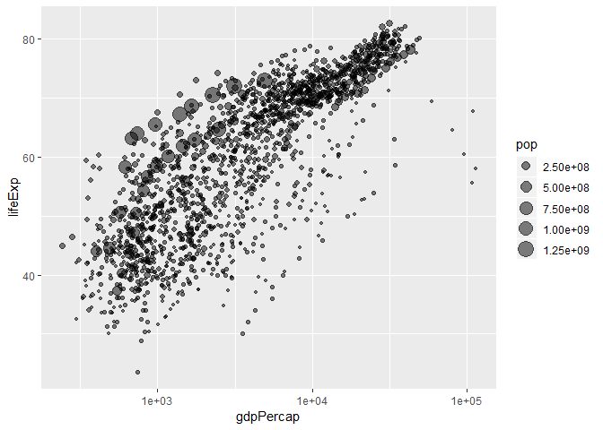

-   Try adding `scale_radius()` and `scale_size_area()`. What's better?

``` r
gvsl + geom_point(aes(size=pop), alpha=0.5) +
  scale_size_area()
```

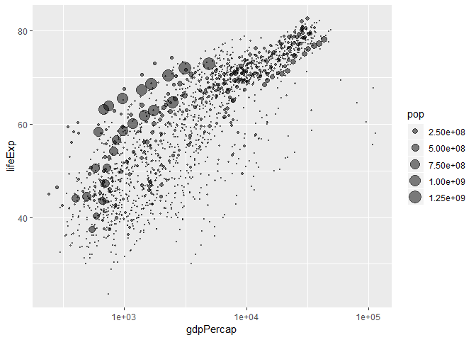

-   Use `shape=21` to distinguish between `fill` (interior) and `colour` (exterior).

``` r
gvsl + geom_point(aes(size=pop, fill=continent), shape=21, colour="black")
```

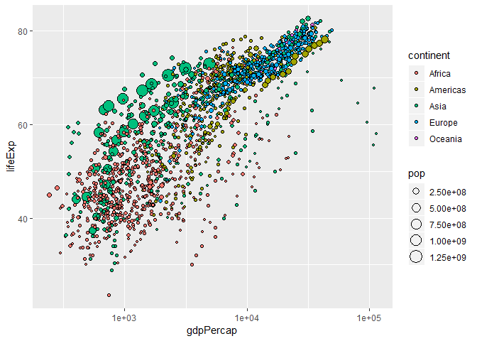

"Complete" plot
---------------

Let's try plotting much of the data.

-   gdpPercap vs lifeExp with pop bubbles
-   facet by year
-   colour by continent

``` r
gvsl + geom_point(aes(size=pop, colour=continent)) +
  scale_size_area() + 
  facet_wrap(~year)
```


Continue from last time (geom exploration with `x` and `y` aesthetics)
======================================================================

Path plots
----------

Let's see how Rwanda's life expectancy and GDP per capita have evolved over time, using a path plot.

-   Try `geom_line()`. Try `geom_point()`.

``` r
gapminder %>%
  filter(country == "Rwanda") %>% 
  ggplot(aes(gdpPercap, lifeExp)) + 
  geom_point()
```


``` r
# gapminder %>%
#   filter(country == "Rwanda") %>% 
#   ggplot(aes(gdpPercap, lifeExp)) + 
#   geom_point() +
#   geom_line() #Just connects points left to right

gapminder %>%
  filter(country == "Rwanda") %>% 
  ggplot(aes(gdpPercap, lifeExp)) + 
  geom_point() +
  geom_path(arrow = arrow()) #Connects dots in the order that they appear in the data frame
```

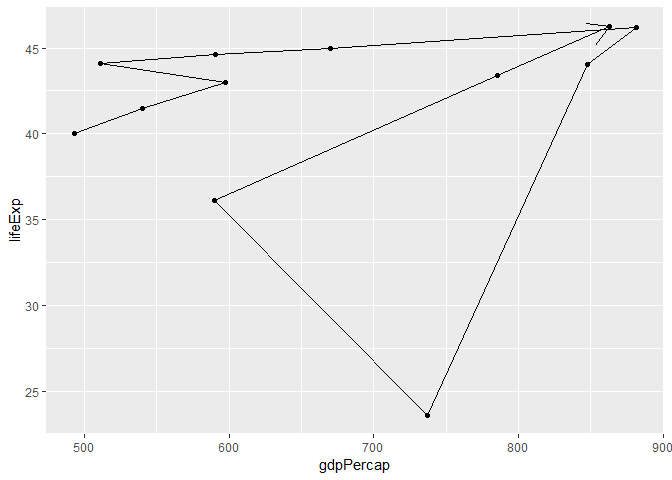

``` r
#Double checking that the data is arranged by year:

gapminder %>%
  filter(country == "Rwanda") %>% 
  arrange(year) %>%
  ggplot(aes(gdpPercap, lifeExp)) + 
  geom_point() +
  geom_path(arrow = arrow())
```


-   Add `arrow=arrow()` option.
-   Add `geom_text`, with year label.

Two categorical variables
-------------------------

Try `cyl` (number of cylinders) ~ `am` (transmission) in the `mtcars` data frame.

-   Scatterplot? Jitterplot? No.
-   `geom_count()`.
-   `geom_bin2d()`. Compare with `geom_tile()` with `fill` aes.

``` r
# ggplot(mtcars, aes(cyl, am)) + 
#   geom_point() #Super ugly and ineffective for this data combo

# ggplot(mtcars, aes(cyl, am)) +
#   geom_jitter() #Not helpful either, very messy!

ggplot(mtcars, aes(cyl, am)) + 
  geom_count()
```

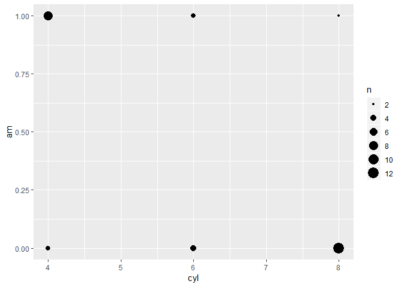

``` r
ggplot(mtcars, aes(factor(cyl), factor(am))) + 
  geom_bin2d()
```

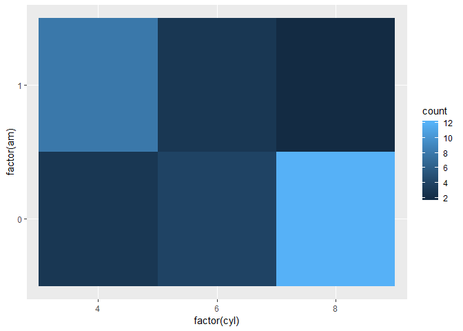

``` r
# ggplot(mtcars, aes(factor(cyl), factor(am))) + 
#   geom_tile() #Allows you to set the colours, but this code doesn't run correctly
```

Overplotting
------------

Try a scatterplot with:

-   Alpha transparency.
-   `geom_hex()`

``` r
library(hexbin)
gvsl + geom_hex()
```

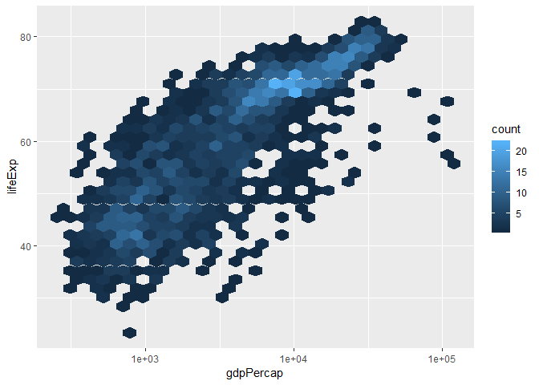

-   `geom_density2d()`

``` r
gvsl + geom_density2d()
```

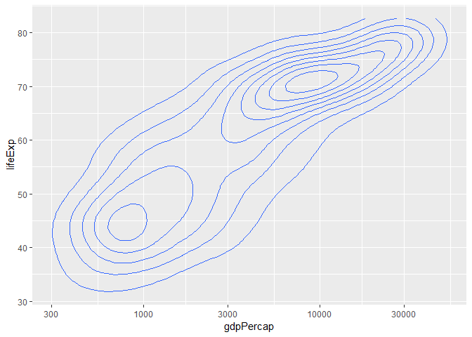

-   `geom_smooth()`

``` r
gvsl + geom_smooth() +
  geom_point(alpha=0.1)
```

    ## `geom_smooth()` using method = 'gam' and formula 'y ~ s(x, bs = "cs")'

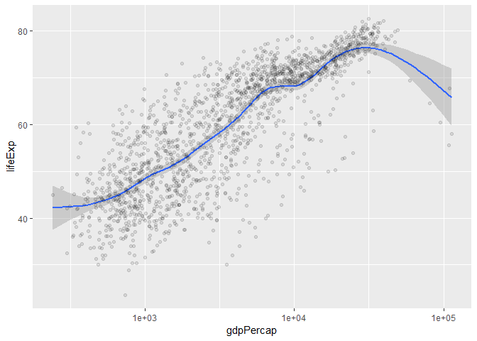

``` r
gvsl + geom_smooth(method="lm") +
  geom_point(alpha=0.1)
```

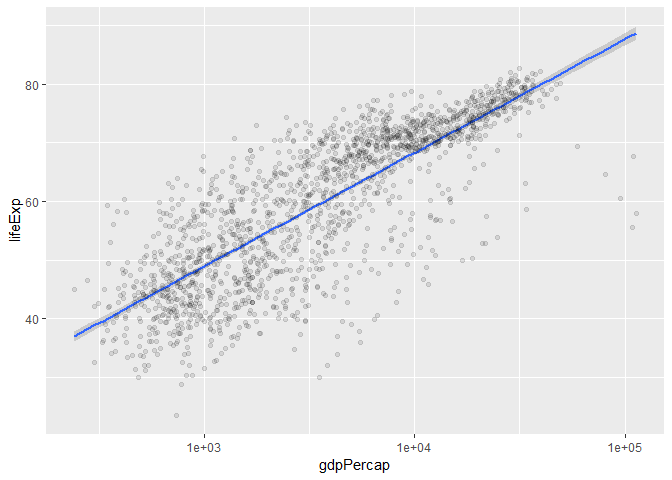

Bar plots
---------

How many countries are in each continent? Use the year 2007.

1.  After filtering the gapminder data to 2007, make a bar chart of the number of countries in each continent. Store everything except the geom in the variable `d`.

``` r
gapminder %>% 
  filter(year == 2007) %>%
  ggplot(aes(x=continent)) +
  geom_bar()
```


1.  Notice the y-axis. Oddly, `ggplot2` doesn't make it obvious how to change to proportion. Try adding a `y` aesthetic: `y=..count../sum(..count..)`.

**Uses of bar plots**: Get a sense of relative quantities of categories, or see the probability mass function of a categorical random variable.

Polar coordinates
-----------------

-   Add `coord_polar()` to a scatterplot.

``` r
gvsl + geom_point() +
  coord_polar() #Not useful in this case, but it could be! Maybe if you have one variable as day of year?
```


Want more practice?
===================

If you'd like some practice, give these exercises a try

**Exercise 1**: Make a plot of `year` (x) vs `lifeExp` (y), with points coloured by continent. Then, to that same plot, fit a straight regression line to each continent, without the error bars. If you can, try piping the data frame into the `ggplot` function.

``` r
ggplot(gapminder, aes(x=year, y=lifeExp)) +
  geom_point(aes(colour=continent)) +
  geom_smooth(aes(colour=continent), method="lm", se=FALSE)
```


**Exercise 2**: Repeat Exercise 1, but switch the *regression line* and *geom\_point* layers. How is this plot different from that of Exercise 1?

``` r
ggplot(gapminder, aes(x=year, y=lifeExp)) +
  geom_smooth(aes(colour=continent), method="lm", se=FALSE) +
  geom_point(aes(colour=continent))
```

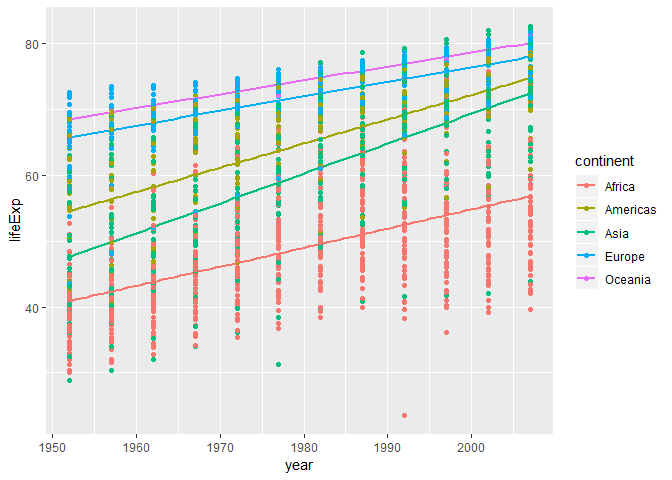

Points are either in front of or behind the regression lines. SUPER HARD TO TELL.

**Exercise 3**: Omit the `geom_point` layer from either of the above two plots (it doesn't matter which). Does the line still show up, even though the data aren't shown? Why or why not?

``` r
ggplot(gapminder, aes(x=year, y=lifeExp)) +
  geom_smooth(aes(colour=continent), method="lm", se=FALSE)
```

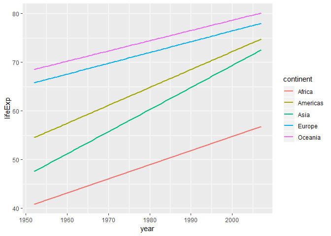

Yep the lines still show up. That makes sense though as the lines are calculated from the data, not from the points on the graph!

**Exercise 4**: Make a plot of `year` (x) vs `lifeExp` (y), facetted by continent. Then, fit a smoother through the data for each continent, without the error bars. Choose a span that you feel is appropriate.

``` r
ggplot(gapminder, aes(x=year, y=lifeExp)) +
  facet_wrap(~ continent) + 
  geom_point() +
  geom_smooth(se=FALSE)
```

    ## `geom_smooth()` using method = 'loess' and formula 'y ~ x'

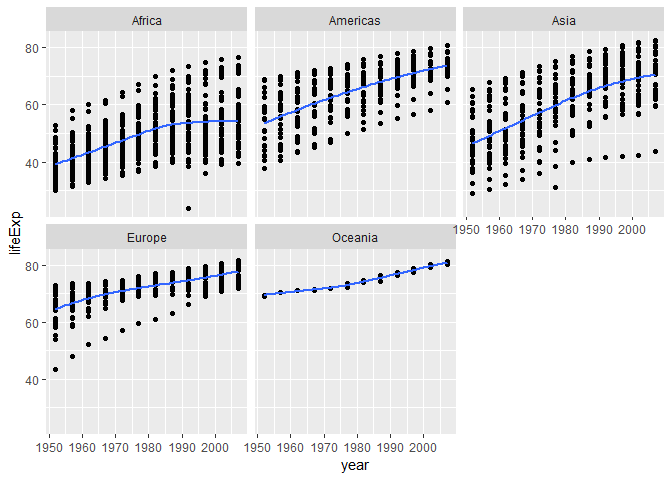

**Exercise 5**: Plot the population over time (year) using lines, so that each country has its own line. Colour by `gdpPercap`. Add alpha transparency to your liking.

``` r
ggplot(gapminder, aes(x=year, y=lifeExp)) +
  geom_line(aes(colour=country, alpha=0.2)) +
  theme(legend.position = "none")
```

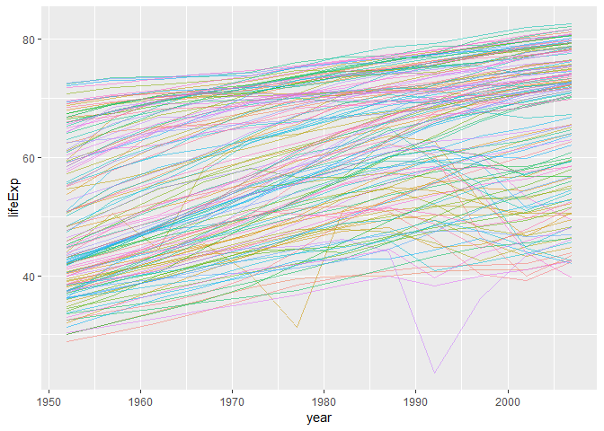

**Exercise 6**: Add points to the plot in Exercise 5.

``` r
ggplot(gapminder, aes(x=year, y=lifeExp)) +
  geom_point(aes(colour=country, alpha=0.2)) +
  geom_line(aes(colour=country, alpha=0.2)) +
  theme(legend.position = "none")
```

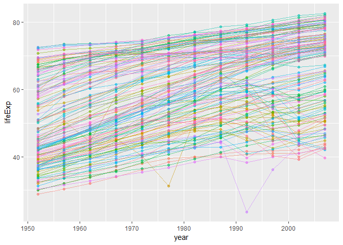
